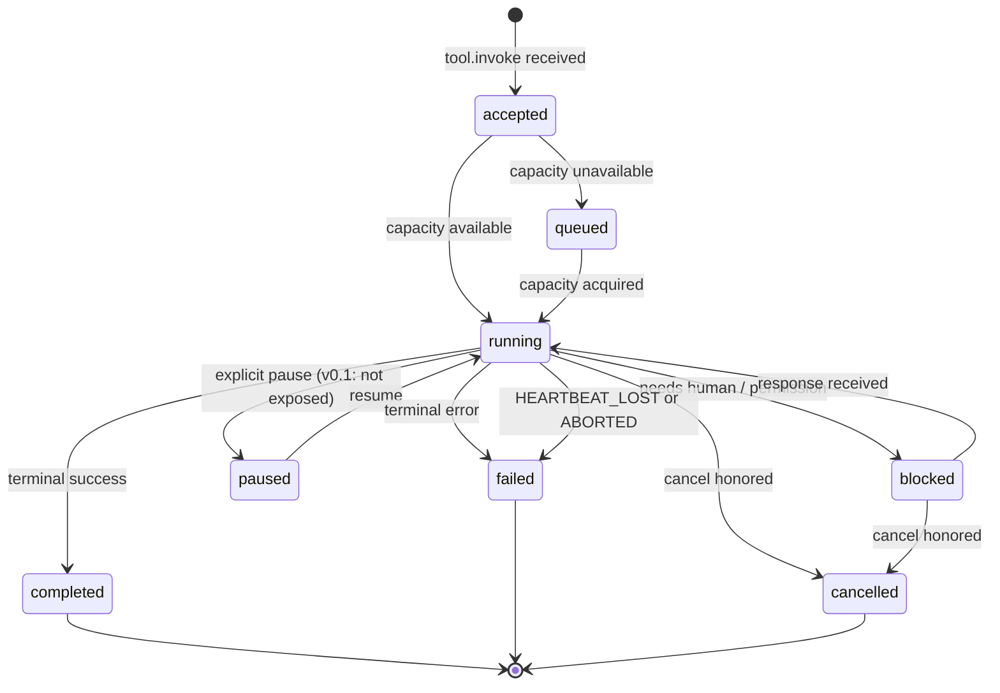
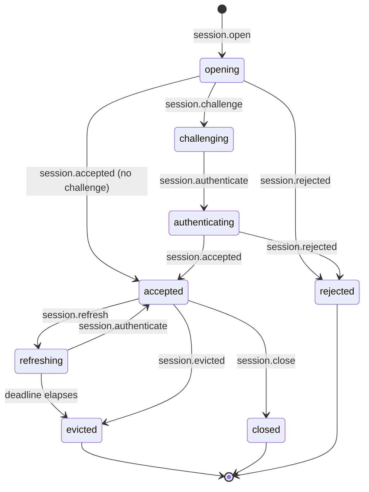
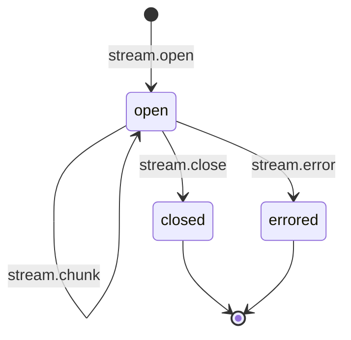
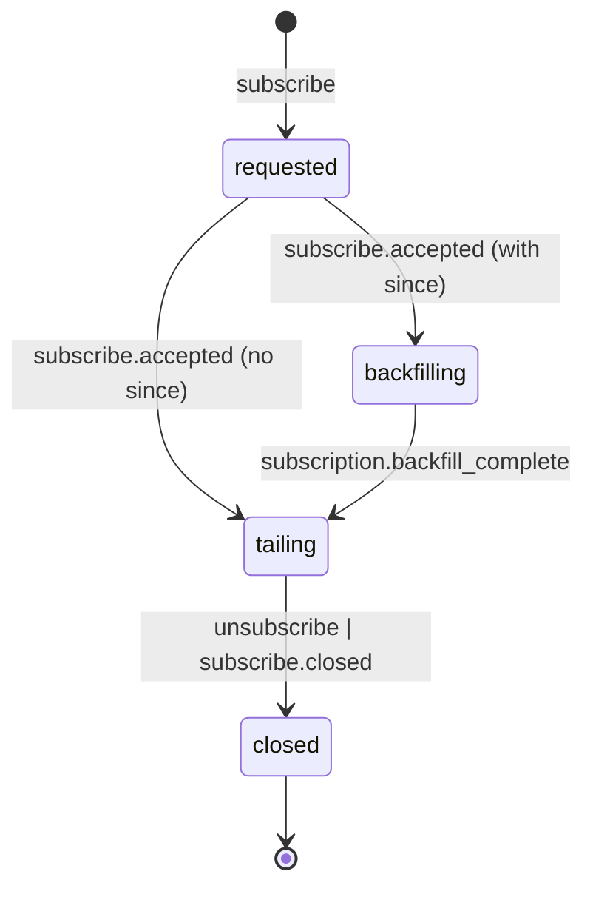
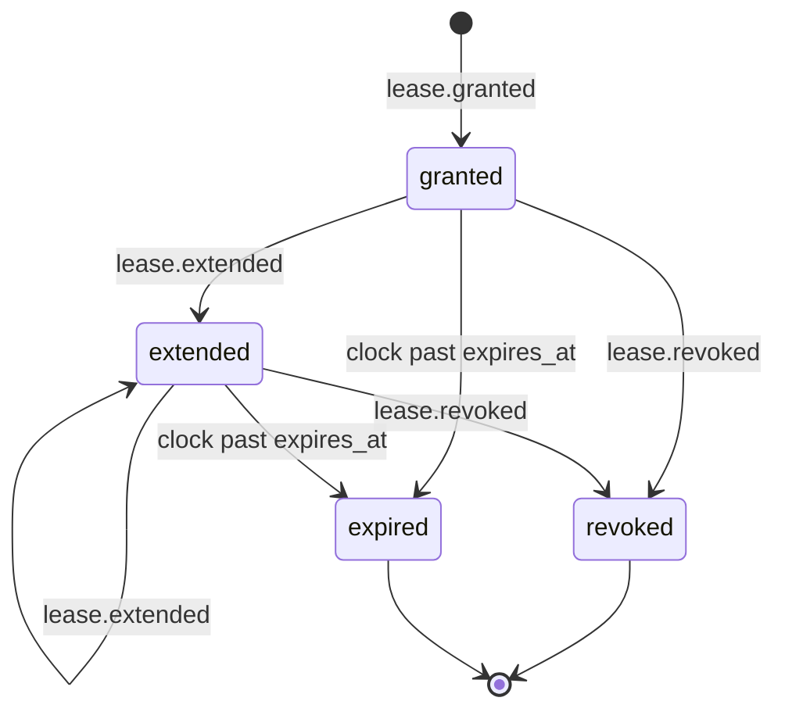

# ARCP Python Reference Implementation — Plan (`arcp-py` v0.1)

This document is the living plan for the reference implementation of ARCP v1.0 in
Python. It must be read alongside `RFC-0001-v2.md`. Section numbers below refer
to that document.

## 0. Scope Restatement

In scope for v0.1: envelope (§6.1), capability negotiation (§7), authentication
schemes `bearer` / `signed_jwt` / `none` only (§8), sessions stateless and
stateful (§9), full job state machine (§10) including heartbeats, cancellation,
and interrupts (but not §10.6 scheduled jobs), streams of kinds
`text` / `event` / `log` / `thought` with base64 binary only (§11), full HITL
primitives (§12), full permission/lease lifecycle (§15.1–§15.5), subscriptions
(§13), artifacts inline-only (§16), error model (§18), extensions (§21),
observability primitives (§17) without backend egress, WebSocket and stdio
transports (§22), SQLite event log with idempotency, replay, and
message-id-based resume (§19).

Explicitly deferred to v0.2 (raise `NotImplementedError` at edges): mTLS and
OAuth2 schemes; sidecar binary stream frames; scheduled jobs (§10.6);
multi-agent delegation/handoff (§14); workflow primitives; trust elevation
(§15.6); checkpoint-based resume; artifact retention/GC beyond a simple expiry
sweep; quorum response policies for HITL.

## 1. RFC Section-by-Section Summary (Implementation Lens)

### §1–§5 Goals, Non-Goals, Terminology, Principles, Architecture

These sections frame intent. The hard implementation constraints they
establish: (a) no traffic before authentication (§4.6); (b) extensibility
(§4.7); (c) three principal client roles — active client, observer, peer
runtime (§5). Observers materialize as session principals that hold
subscriptions but no job-issuing capabilities. Peer runtimes are deferred.

### §6 Core Protocol Concepts

Envelope is the universal carrier. The full field set in §6.1.1 is
non-negotiable for v0.1: every field is implemented, even when v0.1 does not
exercise it (e.g. `parent_span_id`).

Two distinct keys: `id` (transport idempotency) and `idempotency_key` (logical
intent idempotency). Implementation: SQLite event log uses `id` as a unique
constraint per session; a separate `(session_principal, idempotency_key)`
table stores logical intent results so retries return the prior outcome
(§6.4).

`priority` is implemented as scheduling hint at the runtime egress queue
(weighted fair-share between sessions; never reorder within a `stream_id`
or `job_id`).

### §7 Capability Negotiation

Capabilities live on `session.open.payload.capabilities` and are echoed on
`session.accepted.payload.capabilities` after intersection. Required-but-
unsupported features → `session.rejected` with `code: UNIMPLEMENTED`. The
runtime maintains a static advertised set; the client may request a subset.
v0.1 advertises:

```json
{
  "streaming": true,
  "durable_jobs": true,
  "checkpoints": false,
  "binary_streams": true,
  "binary_encoding": ["base64"],
  "agent_handoff": false,
  "human_input": true,
  "artifacts": true,
  "subscriptions": true,
  "scheduled_jobs": false,
  "interrupt": true,
  "anonymous": false,
  "heartbeat_interval_seconds": 30,
  "heartbeat_recovery": "fail",
  "artifact_retention": {"default_seconds": 3600, "max_seconds": 86400},
  "extensions": []
}
```

### §8 Authentication & Identity

Four-step handshake: `session.open` → (`session.challenge` →
`session.authenticate`)? → `session.accepted` | `session.rejected`.
Pre-acceptance, runtime drops and logs all non-handshake messages. Schemes:

- `bearer`: opaque string validated against an in-process `TokenValidator`
  injected at runtime construction time. Default validator rejects everything;
  tests pass a `StaticTokenValidator({"tok": principal})`.
- `signed_jwt`: PyJWT verifies signature against an injected `JWKS` or shared
  secret; `aud` must match runtime identity.
- `none`: only when `capabilities.anonymous: true` was negotiated. Default
  config does not advertise `anonymous`, so `none` is rejected by default
  (§4.6, §8.2).

Re-authentication (`session.refresh`) and eviction (`session.evicted`) are
implemented; eviction reasons are drawn from `ErrorCode` plus a `reason` enum.

### §9 Sessions

Stateless: no inter-job memory; session state purely transport-scoped.
Stateful: `SessionState` dictionary that survives across jobs in the same
session. Durable sessions deferred (resume works against stateful sessions).
`session.close` cancels open jobs by default (RFC says runtime/closer policy);
closer can request `detach: true` to leave jobs running.

### §10 Jobs

State machine, exactly the eight states in §10.2. Implementation in
`runtime/job.py`:



Heartbeats: per-job asyncio task starts on transition to `running`, sleeps
`heartbeat_interval_seconds`, asserts the job emitted at least one heartbeat
in the prior interval. Two consecutive misses → `HEARTBEAT_LOST` per the
configured `heartbeat_recovery` policy.

Cancellation: `asyncio.Event` per job; the executable inspects it at
`yield`-style checkpoints. If the event fires, the job has `deadline_ms` to
emit a terminal event; otherwise the asyncio task is cancelled and a
synthetic `ABORTED` terminal event is emitted.

Interrupts: distinct from cancel. Transition to `blocked`, emit
`human.input.request`, resume on response. v0.1 implements this for jobs
that explicitly support an `interrupt_handler`.

Scheduled jobs (§10.6): not implemented; `job.schedule` returns `nack` with
`code: UNIMPLEMENTED`.

### §11 Streaming

Stream kinds: `text`, `event`, `log`, `metric`, `thought` are core in v0.1.
`binary` is implemented but only via in-envelope base64 — no sidecar.
`stream.open` declares kind/content_type/encoding. Per-stream sequence
numbers strictly monotonic per `stream_id`. Backpressure: receiver-side
buffer watermark sends `backpressure` envelope; sender-side throttles by
sleeping between `stream.chunk` emits when desired_rate is set.

Reasoning streams: kind `thought` carries `role`/`content`/`redacted`. v0.1
emits with `redacted: false` by default; subscribers can filter by kind.

### §12 Human-in-the-Loop

`human.input.request` → blocks the requesting job, registers a pending
future in `PendingRequestRegistry` keyed by request `id`, awaits
`human.input.response` whose `correlation_id` resolves the future. Schema
validation on `value` against `response_schema` via `jsonschema` (added
dependency, justified below). Invalid responses reject with `nack` /
`INVALID_ARGUMENT`.

`human.choice.request` is the typed picker variant; response carries
`choice_id`, validated as one of the offered options.

Multi-channel resolution: first-response-wins by default; quorum is deferred.
Late responses get a `human.input.cancelled` echo to clear stale prompts.

Expiration: `expires_at` is mandatory. A timer task fires; if `default` is
present, runtime synthesizes a `human.input.response` with
`responded_by: "default"`; otherwise emits `human.input.cancelled` with
`code: DEADLINE_EXCEEDED`.

### §13 Subscriptions

`subscribe` → `subscribe.accepted` (carries `subscription_id`) → 0..n
`subscribe.event` → `subscribe.closed`. Filter terms (§13.2): `session_id`,
`trace_id`, `job_id`, `stream_id`, `types`, `min_priority`. AND across
fields, OR within array values. The runtime evaluates filters against every
event before delivery. Authorization gate: subscriber session must have
`observer` role for the targeted session(s); else `PERMISSION_DENIED`.

Backfill (§13.3): if `since.after_message_id` is present, the
`SubscriptionManager` opens a transactional cursor over the event log,
streams replay events through the same filter pipeline, then emits a
synthetic `subscribe.event` whose `payload.event` is an `event.emit` of type
`subscription.backfill_complete`, then transitions to live tail. The event
log is sequence-ordered by `(session_id, rowid)`; the live publisher writes
through the same log so there is no gap.

### §14 Multi-Agent

Out of scope. `agent.delegate` and `agent.handoff` exist as message types in
the registry (so unknown-message handling does not fire) but the runtime
returns `nack` with `code: UNIMPLEMENTED`.

### §15 Permissions & Security

Permission model (§15.1) is a free-form string per RFC; v0.1 treats it as
opaque. Sandboxing (§15.2) is delegated to the tool implementation. Trust
levels (§15.3) are fields on identity blocks but unenforced in v0.1.

Permission challenge flow (§15.4): runtime detects an operation needing a
permission not on the active lease set → `permission.request` + transition
job to `blocked` → wait on `permission.grant` / `permission.deny` →
materialize a lease on grant or fail on deny.

Lease lifecycle (§15.5): `LeaseManager` indexes by `(session_id, lease_id)`,
emits `lease.granted`/`lease.extended`/`lease.revoked`, processes
`lease.refresh`. Operations against revoked/expired leases fail
`PERMISSION_DENIED`.

Trust elevation (§15.6): deferred. Synthetic `trust.elevate.<level>`
permissions return `UNIMPLEMENTED`.

### §16 Artifacts

`ArtifactStore` keeps inline base64 in SQLite blobs by default; v0.1 does
not implement sidecar upload. `artifact.put` allocates an id and stores
`(media_type, sha256, size, expires_at, blob)`. `artifact.fetch` returns
inline data or `NOT_FOUND` if expired/released. `artifact.release` marks
deleted; a periodic sweep expires entries past `expires_at`.

Retention is advertised in capabilities; runtime enforces `max_seconds`
upper bound on requested retention.

### §17 Observability

`log`, `metric`, `trace.span` envelopes are implemented as primary message
types. The runtime exposes `Runtime.log()`, `Runtime.metric()`, and
`Runtime.span()` helpers that emit envelopes through the normal egress
pipeline (so subscriptions see them).

Reserved metric names (§17.3.1) are enums in `messages/telemetry.py`;
helpers validate names and units. `trace_id` and `span_id` propagation is
preserved verbatim across delegation boundaries (degenerate in v0.1 since
no peer runtime is implemented, but the plumbing is in place).

### §18 Error Model

`ErrorCode` is a `StrEnum` covering every code in §18.2, plus a
`is_retryable_default()` helper aligned with §18.3.

`ARCPError` is a Python exception that carries `code`, `message`,
`retryable`, `details`, `cause`. Boundary code (transport, dispatch) catches
narrow exceptions and rethrows as `ARCPError` with the right code. Errors
serialize into `tool.error` / `nack` / structured event payloads as
appropriate to the context.

### §19 Resumability

Message-id resume only. `resume` envelope carries `after_message_id`.
Runtime locates the row in the event log, replays subsequent rows in order
(filtered by session/job to avoid leaking other sessions' state), then
transitions to live. If retention has expired the resume returns `DATA_LOSS`
per §19. `checkpoint_id`-based resume returns `UNIMPLEMENTED`.

### §20 MCP Compatibility

Out of scope to integrate with MCP in v0.1 — but the modeling decisions
(no parallel resource concept; resources as artifacts or `event` streams)
are honored.

### §21 Extensions

`ExtensionRegistry` validates names against `arcpx.<vendor>.<name>.v<n>` or
reverse-DNS. Bare `x-` is rejected for long-lived deployments. Unknown
message handling (§21.3): if the type prefix is core (`session.`, `job.`,
`tool.`, `stream.`, `human.`, `permission.`, `lease.`, `subscribe`,
`subscription.`, `artifact.`, `event.`, `log`, `metric`, `trace.`, `ack`,
`nack`, `cancel`, `interrupt`, `resume`, `backpressure`, `ping`, `pong`)
and unrecognized → `nack` `UNIMPLEMENTED`. If namespaced and not advertised
→ silent drop iff `extensions.optional: true`, else `nack` `UNIMPLEMENTED`.
Receiver MUST NOT crash.

### §22 Reference Transports

WebSocket via `websockets` library (server `serve()`, client `connect()`).
stdio via newline-delimited JSON over `sys.stdin`/`sys.stdout`. Both
implement an abstract `Transport` interface with `send(envelope: dict)`,
`recv() -> dict`, and `close()`. WebSocket reconnect with backoff in client.

### §23–§28 Examples, Future Work

These sections inform the example scripts and `CONFORMANCE.md`.

## 2. Message Type → Module Map

| Message type                                                                                                  | Module                       |
| ------------------------------------------------------------------------------------------------------------- | ---------------------------- |
| `session.open`/`challenge`/`authenticate`/`accepted`/`unauthenticated`/`rejected`/`refresh`/`evicted`/`close` | `messages/session.py`        |
| `ping`/`pong`/`ack`/`nack`                                                                                    | `messages/control.py`        |
| `cancel`/`cancel.accepted`/`cancel.refused`/`interrupt`/`resume`/`backpressure`                              | `messages/control.py`        |
| `checkpoint.create`/`checkpoint.restore`                                                                      | `messages/control.py` (stub) |
| `tool.invoke`/`tool.result`/`tool.error`                                                                       | `messages/execution.py`      |
| `job.accepted`/`job.started`/`job.progress`/`job.heartbeat`/`job.checkpoint`/`job.completed`/`job.failed`/`job.cancelled` | `messages/execution.py`      |
| `job.schedule`/`workflow.start`/`workflow.complete`/`agent.delegate`/`agent.handoff`                          | `messages/execution.py` (stub) |
| `stream.open`/`stream.chunk`/`stream.close`/`stream.error`                                                     | `messages/streaming.py`      |
| `human.input.request`/`human.input.response`/`human.choice.request`/`human.choice.response`/`human.input.cancelled` | `messages/human.py`          |
| `permission.request`/`permission.grant`/`permission.deny`                                                      | `messages/permissions.py`    |
| `lease.granted`/`lease.extended`/`lease.revoked`/`lease.refresh`                                               | `messages/permissions.py`    |
| `subscribe`/`subscribe.accepted`/`subscribe.event`/`unsubscribe`/`subscribe.closed`                            | `messages/subscriptions.py`  |
| `artifact.put`/`artifact.fetch`/`artifact.ref`/`artifact.release`                                              | `messages/artifacts.py`      |
| `event.emit`/`log`/`metric`/`trace.span`                                                                       | `messages/telemetry.py`      |

The synthetic `subscription.backfill_complete` is registered as an
`event.emit` payload type, not a top-level envelope type, per §13.3.

## 3. State Machines

### 3.1 Session



### 3.2 Stream



### 3.3 Subscription



### 3.4 Lease



### 3.5 Job

See §10.2 mermaid above.

## 4. Open Questions and Chosen Interpretations

1. **§6.1.1 `parent_span_id`**: not in the §17.1 list; included only in the
   envelope table. Interpretation: implement as optional but unused by the
   runtime in v0.1; round-trip preserved.
2. **§8 — `session.unauthenticated`**: listed in §6.2 but not described
   elsewhere. Interpretation: emitted when a non-handshake message arrives
   on a session that has not yet completed `session.accepted`. Carries the
   id of the rejected message in `correlation_id`.
3. **§10.2 `paused`**: no message type drives this. Interpretation: not
   exposed in v0.1 except as a state in the FSM that tests will not exercise.
   No public API to enter `paused`; future extension.
4. **§10.4 cancel of a session**: maps to `session.evicted reason: cancelled`.
   v0.1 only supports session cancel via explicit `session.close`; an
   external `cancel` of a session returns `FAILED_PRECONDITION`.
5. **§11.1 unknown stream kinds**: "treat as event". Interpretation:
   accepted with a structured-event renderer; subscribers see `kind: <as-sent>`.
6. **§11.4 redaction**: producer's responsibility. v0.1 does not redact;
   tests will cover the pass-through of `redacted: true` from a tool.
7. **§12.4 escalate per policy**: undefined. Interpretation: in absence of
   `default`, mark requesting job `failed` with `DEADLINE_EXCEEDED` cause.
8. **§13.2 authorization**: RFC says runtime "MUST reject filters that would
   expose unauthorized data". Interpretation: v0.1 has a single principal
   per session; subscribers can subscribe to their own sessions or to any
   session if the principal has the synthetic role `arcp.observer.all`.
   This is documented in `CONFORMANCE.md`.
9. **§15 lease grant authority**: who can issue `permission.grant`? RFC says
   "client". Interpretation: only the session that owns the requesting job
   can grant. Cross-session grants are deferred.
10. **§16.2 `artifact.fetch` redirect**: RFC allows a redirect URI. v0.1
    only returns inline data; redirect returns `UNIMPLEMENTED` if requested.
11. **§19 retention boundary**: RFC says "DATA_LOSS" if retention expired.
    Interpretation: a `resume` after the event log's GC horizon (configurable,
    default 24h) returns `nack` `DATA_LOSS` with `correlation_id` of the
    `resume` envelope.
12. **§21.3 unknown message ordering**: namespaced silent drops are still
    logged at debug level via `structlog`, not silently swallowed.
13. **§7 capability intersection**: when client requests `streaming: true`
    and runtime advertises it, accepted set has `streaming: true`. When
    client requests something runtime does not have, this is rejected
    only if the client marked it required. v0.1 treats every requested
    capability as required for simplicity, since the RFC does not define
    a "preferred" semantic.

## 5. Dependencies

Pinned in `pyproject.toml`. Justifications:

- `pydantic` (>=2.7) — typed envelopes & payloads (mandated by build prompt).
- `aiosqlite` (>=0.20) — async SQLite event log (mandated).
- `websockets` (>=13) — WS transport (mandated).
- `structlog` (>=24) — structured logging (mandated).
- `pyjwt` (>=2.9) with `[crypto]` extra — `signed_jwt` auth (mandated).
- `click` (>=8.1) — CLI (mandated).
- `jsonschema` (>=4.23) — `human.input.request.response_schema` validation
  (§12.1 explicitly references JSON Schema; not in starting set, justified
  here as additive).
- Test set: `pytest` (>=8), `pytest-asyncio` (>=0.24), `pytest-cov` (>=5).
- Dev: `ruff` (>=0.6), `pyright` (>=1.1).

## 6. Test Plan

Unit tests (`tests/unit/`):

- `test_envelope.py`: round-trip every field combo; reject unknown `type`
  values; coerce timestamps; preserve `extensions` dict verbatim.
- `test_errors.py`: full taxonomy coverage; retryable-default classification.
- `test_messages_*.py` (one per message module): payload validation and
  rejection cases; discriminated-union dispatch.
- `test_extensions.py`: namespace acceptance/rejection; unknown core type →
  nack; unknown namespaced + `optional: true` → silent drop; recognition of
  `arcpx.*` and reverse-DNS forms.
- `test_eventlog.py`: append, dedup on `id`, replay ordering, retention
  cutoff, cross-session isolation.

Integration tests (`tests/integration/`):

- `test_handshake.py`: bearer happy-path; bearer bad-token →
  `UNAUTHENTICATED`; signed_jwt happy/bad-aud/bad-sig; `none` rejected
  unless `anonymous` negotiated; pre-acceptance message dropped + logged;
  capability intersection; required-but-unsupported → `UNIMPLEMENTED`.
- `test_job_lifecycle.py`: tool.invoke → ack → started → progress (≥3) →
  completed; failure path → `tool.error` + `job.failed`; idempotency_key
  replay returns prior result.
- `test_human_input.py`: round-trip with schema validation; invalid value
  → `INVALID_ARGUMENT`; choice with id outside options → `INVALID_ARGUMENT`;
  expiration with `default` → synthesized response; expiration without
  `default` → `human.input.cancelled` + `DEADLINE_EXCEEDED`.
- `test_permission_lease.py`: challenge flow blocked→running; deny path;
  lease refresh extends; revoke causes subsequent op to
  `LEASE_REVOKED`; expiry mid-op → `LEASE_EXPIRED`.
- `test_subscription.py`: filter by every dimension; backfill ordering;
  backfill→live boundary `subscription.backfill_complete`;
  unauthorized session → `PERMISSION_DENIED`; subscribe.closed on auth
  expiry.
- `test_cancellation.py`: cooperative cancel within deadline →
  `job.cancelled`; deadline exceeded → `ABORTED`; non-cancellable job →
  `cancel.refused FAILED_PRECONDITION`.
- `test_interrupt.py`: interrupt transitions to blocked, emits
  `human.input.request`, resumes on response.
- `test_artifact.py`: put/fetch/release; fetch after release → `NOT_FOUND`;
  retention sweep removes expired; sha256 mismatch → `INVALID_ARGUMENT`.
- `test_resume.py`: hard-disconnect midway through a job; reconnect with
  `after_message_id`; replay yields exactly the missed messages followed
  by live; retention-expired resume → `DATA_LOSS`.
- `test_extension_unknown.py`: namespaced unknown w/ `optional: true` is
  dropped; w/o is `UNIMPLEMENTED`; unknown core prefix is `UNIMPLEMENTED`;
  receiver continues to function after either.

E2E (`tests/e2e/test_relay_scenario.py`): runtime + tool agent + observer.
Agent invokes a "deploy" tool that requests human approval; observer
(acting as human) responds; tool produces an artifact; job completes.
Run parametrized over WebSocket and stdio.

## 7. Phase Plan and Gates

Phases as in the build prompt. Each gate runs:

```sh
uv run pyright
uv run ruff check
uv run pytest --cov=arcp --cov-fail-under=85
```

Each phase ends with a single commit named `phase N: <description>`.
Sub-agents are used in Phase 2 (one per message-type module — interface
contract is "Pydantic model + payload schema + tests against fixture
JSON"), in Phase 3 (job/stream/cancellation), and in Phase 5
(subscription/artifact). Sub-agents are NOT used for runtime/server.py
itself, since the dispatch logic must remain coherent.

## 8. Repository Layout

As specified in the build prompt. Created in Phase 0; modules created
empty (or with `pass`/docstring stubs) so that import-graph references
work from the start.
