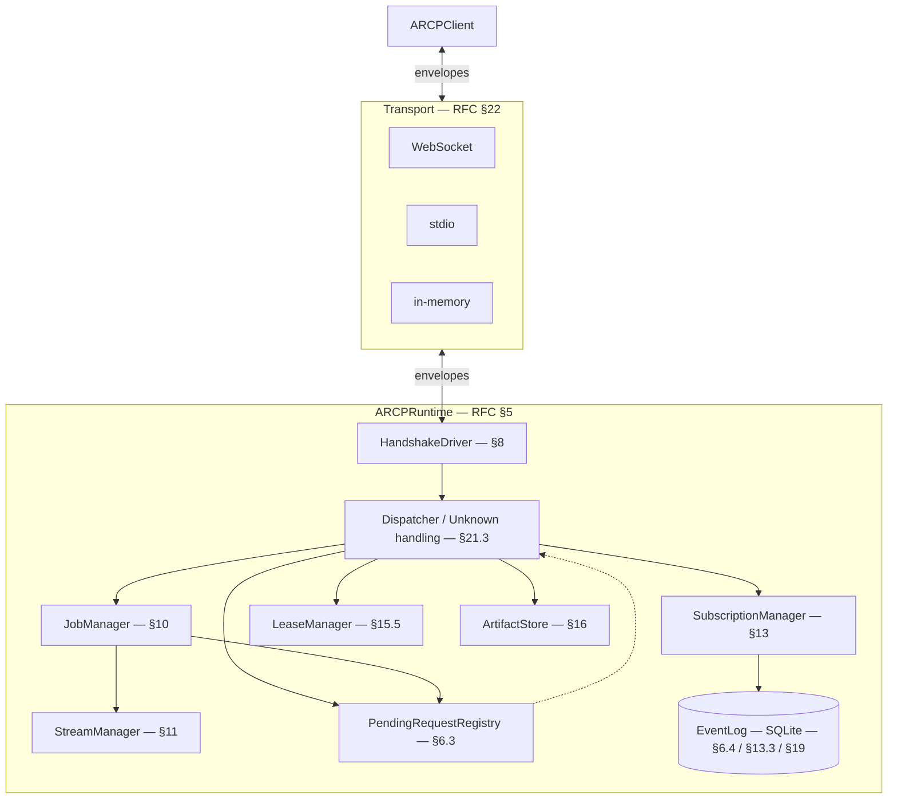

# `arcp` — Python reference implementation of ARCP v1.0

This package implements the Agent Runtime Control Protocol (ARCP) v1.0 as
specified in `RFC-0001-v2.md`. It is intentionally small and readable: every
public symbol traces back to a specific RFC section.

See `CONFORMANCE.md` for the implemented-vs-deferred mapping and `PLAN.md`
for the implementation plan.

## Quickstart

```sh
cd python-sdk/arcp-sdk
uv sync --extra dev
uv run pytest --cov=arcp
```

Run the minimal example end-to-end:

```sh
cd examples
uv run python 01_minimal_session.py
```

Start a real WebSocket runtime and send a `ping`:

```sh
uv run arcp serve --transport ws --bind 127.0.0.1:7777 --token demo=alice &
uv run arcp send --uri ws://127.0.0.1:7777 --token demo --type ping --payload '{"nonce":"x"}'
```

## Architecture



## Key concepts

- **Envelope** (`arcp.envelope.Envelope`) — every ARCP message; full §6.1 field set.
- **ARCPRuntime** (`arcp.runtime.server.ARCPRuntime`) — accepts transports,
  drives handshakes, dispatches.
- **ARCPClient** (`arcp.client.client.ARCPClient`) — opens a session, sends
  commands, receives events.
- **Tools** are async callables registered via `runtime.register_tool(name, impl)`
  with signature `async def impl(ctx: JobContext, args: dict) -> Any`. The
  `JobContext` provides `progress()`, `heartbeat()`, `open_stream()`,
  `request_human_input()`, `request_human_choice()`, `request_permission()`.

## Status

v0.1.0 — see `CONFORMANCE.md` for what is implemented vs. deferred. The
package targets correctness and traceability over performance.

## Examples

| Path                                       | Demonstrates                                       |
| ------------------------------------------ | -------------------------------------------------- |
| `examples/01_minimal_session.py`           | RFC §8 handshake + ping/pong                       |
| `examples/02_tool_invoke_with_progress.py` | RFC §10 jobs + §11 streaming                       |
| `examples/03_human_input_request.py`       | RFC §12.1 human input round-trip                   |
| `examples/04_permission_challenge.py`      | RFC §15.4 permission challenge → §15.5 lease grant |
| `examples/05_observer_subscription.py`     | RFC §13 subscriptions                              |
| `examples/06_relay_human_in_the_loop.py`   | Combined §10 + §12 + §15 + §16 scenario             |

Run them from the `examples/` directory: `cd examples && uv run python 06_relay_human_in_the_loop.py`.

## Development

```sh
uv run pyright            # strict mode on src/, must be clean
uv run ruff check         # lint, must be clean
uv run pytest --cov=arcp --cov-fail-under=85
```

Each phase commit (`phase 0` through `phase 7`) corresponds to a hard gate
documented in `PLAN.md`.
