# ARCP Python SDK

[![Apache 2.0 licensed][apache-badge]][apache-url]
[![Python Version][python-badge]][python-url]
[![Protocol][protocol-badge]][protocol-url]
[![Specification][spec-badge]][spec-url]

Python reference implementation of the **Agent Runtime Control Protocol
(ARCP)** v1.0. ARCP is a wire protocol for controlling long-running agents:
sessions, jobs, streams, human-in-the-loop, lease-gated permissions, durable
event logs, observers, and agent handoff/delegation.

This SDK targets correctness and traceability over performance — every
public symbol in `src/arcp/` cites a specific section of
[`RFC-0001-v2.md`](./RFC-0001-v2.md), and the canonical event surface is the
SQLite-backed `EventLog`.

[apache-badge]: https://img.shields.io/badge/license-Apache_2.0-blue.svg
[apache-url]: https://opensource.org/licenses/Apache-2.0
[python-badge]: https://img.shields.io/badge/python-3.13%2B-blue.svg
[python-url]: https://www.python.org/downloads/
[protocol-badge]: https://img.shields.io/badge/ARCP-v1.0-green.svg
[protocol-url]: ./RFC-0001-v2.md
[spec-badge]: https://img.shields.io/badge/spec-RFC--0001--v2-blueviolet.svg
[spec-url]: ./RFC-0001-v2.md

## Table of Contents

- [Overview](#overview)
- [Installation](#installation)
- [Quickstart](#quickstart)
- [What is ARCP?](#what-is-arcp)
- [Architecture](#architecture)
- [Core Concepts](#core-concepts)
  - [Envelopes](#envelopes)
  - [Runtime](#runtime)
  - [Client](#client)
  - [Tools and JobContext](#tools-and-jobcontext)
  - [Streams](#streams)
  - [Reasoning streams](#reasoning-streams)
  - [Subscriptions and observers](#subscriptions-and-observers)
  - [Leases and permissions](#leases-and-permissions)
  - [Human-in-the-loop](#human-in-the-loop)
  - [Artifacts](#artifacts)
  - [Handoff and delegation](#handoff-and-delegation)
  - [Resumability](#resumability)
  - [Extensions](#extensions)
- [Running the runtime](#running-the-runtime)
- [Writing clients](#writing-clients)
- [Authentication](#authentication)
- [Transports](#transports)
- [Errors](#errors)
- [Examples](#examples)
- [Conformance and status](#conformance-and-status)
- [Development](#development)
- [Documentation](#documentation)
- [License](#license)

## Overview

ARCP is to agent runtimes what HTTP is to web servers: a wire-level contract
covering session lifecycle, work submission, progress and heartbeats,
cancellation, human input, permission grants, observer fan-out, durable
event replay, and inter-runtime handoff.

The Python SDK ships:

- A single canonical message type — `arcp.Envelope` — covering every field
  in RFC §6.1.
- An `ARCPRuntime` server that handles handshake, dispatch, jobs, streams,
  subscriptions, leases, artifacts, and resume.
- An `ARCPClient` that drives the §8 handshake, sends commands, awaits
  correlated replies, and exposes a non-correlated event tail.
- WebSocket, stdio, and in-memory transports.
- A SQLite-backed `EventLog` that is the source of truth for dedupe,
  subscription backfill, and resume.
- A small `arcp` CLI for serving, sending one-shot envelopes, tailing a
  running session, and offline replay.

## Installation

This SDK is uv-managed and requires Python 3.13+.

```sh
uv sync --group dev
```

For ad-hoc use the package can be installed directly:

```sh
uv pip install -e .
```

The `arcp` CLI is wired as a console script via the `[project.scripts]` entry
in `pyproject.toml`; no extras are required.

## Quickstart

### Programmatic — runtime + in-memory client

```python
import asyncio
from arcp import ARCPClient, ARCPRuntime
from arcp.messages.session import (
    AuthBlock, Capabilities, Identity, RuntimeIdentity,
)
from arcp.runtime.job import JobContext
from arcp.runtime.server import RuntimeConfig
from arcp.transport.in_memory import create_pair


async def echo(ctx: JobContext, args: dict) -> dict:
    await ctx.progress(percent=50.0, message="halfway")
    return {"echo": args}


async def main() -> None:
    runtime = ARCPRuntime(
        config=RuntimeConfig(
            runtime_identity=RuntimeIdentity(kind="arcp-py", version="0.1.0"),
            advertised_capabilities=Capabilities(anonymous=True, streaming=True),
        )
    )
    runtime.register_tool("echo", echo)
    await runtime.start()

    client_side, server_side = create_pair()
    server_task = asyncio.create_task(runtime.serve_session(server_side))

    client = ARCPClient(
        transport=client_side,
        client_identity=Identity(kind="demo-client", version="0.1"),
        auth=AuthBlock(scheme="none"),
        capabilities=Capabilities(anonymous=True, streaming=True),
    )
    accepted = await client.open()
    print(f"session={accepted.session_id} runtime={accepted.runtime.kind}")

    reply = await client.request(
        client.envelope("tool.invoke", payload={
            "tool": "echo",
            "arguments": {"hello": "world"},
        }),
        timeout=5.0,
    )
    print(reply.type, reply.payload)

    await client.close()
    await runtime.close()
    server_task.cancel()


asyncio.run(main())
```

### CLI — WebSocket runtime + one-shot send

Start a runtime listening on WebSocket with a static bearer token:

```sh
uv run arcp serve --transport ws --bind 127.0.0.1:7777 --token demo=alice
```

In another shell, send a `ping` and print the correlated `pong`:

```sh
uv run arcp send \
  --uri ws://127.0.0.1:7777 \
  --token demo \
  --type ping \
  --payload '{"nonce":"x"}'
```

Tail every event in a running session:

```sh
uv run arcp tail --uri ws://127.0.0.1:7777 --token demo
```

Replay a saved event log offline:

```sh
uv run arcp replay --db ./events.sqlite --session sess_xxx
```

## What is ARCP?

ARCP is the **Agent Runtime Control Protocol** — a wire-level contract for
the control plane around long-running agents. Where MCP describes
*what tools an agent has*, ARCP describes *what the agent is doing right
now*: which job is running, how it's progressing, whether it needs human
input, what permissions it's holding, who is observing it, and how to
hand it off to another runtime.

The core surface (§6.2) is a small set of message-type prefixes:

| Prefix | Purpose | RFC |
| --- | --- | --- |
| `session.*` | Handshake, refresh, eviction, close | §8 |
| `tool.*` / `job.*` | Tool invocation and job lifecycle | §10 |
| `stream.*` | Open/chunk/close streams (text, bytes, thought, event) | §11 |
| `human.*` | `human.input.request` / `.choice.request` / responses | §12 |
| `permission.*` / `lease.*` | Permission challenge → lease grant/refresh/revoke | §15 |
| `subscribe` / `subscription.*` | Observer fan-out, backfill, filters | §13 |
| `artifact.*` | Bytes-by-reference store | §16 |
| `agent.delegate` / `agent.handoff` | Inter-runtime federation | §14 |
| `event.emit` / `log` / `metric` / `trace.*` | Telemetry | §17 |
| `cancel` / `interrupt` / `resume` | Cooperative control + durable replay | §10.4–§10.5, §19 |
| `arcpx.*.v<n>` | Namespaced extensions (per §21) | §21 |

The four wire envelope fields that do most of the work — `correlation_id`,
`causation_id`, `trace_id`, `idempotency_key` — let you stitch any
sequence of envelopes into a coherent execution trace without out-of-band
state.

## Architecture



<sub>Source: [`docs/images/architecture.mmd`](docs/images/architecture.mmd). Re-render with `mmdc -i docs/images/architecture.mmd -o docs/images/architecture.svg -t neutral -b white`.</sub>

Every envelope crossing the runtime is appended to the `EventLog` before
being delivered, dispatched, or broadcast. That property is what enables
`subscribe` backfill, `resume`, idempotency-key dedupe, and offline
`arcp replay`.

## Core Concepts

### Envelopes

`arcp.Envelope` is the one and only message type. Every field in RFC §6.1
is modeled exactly; the schema is `extra="forbid"` so unknown fields fail
fast.

```python
from arcp import Envelope, new_message_id

env = Envelope(
    id=new_message_id(),
    type="tool.invoke",
    session_id="sess_abc",
    trace_id="trace_42",
    idempotency_key="research:t001:plan",
    payload={"tool": "echo", "arguments": {"x": 1}},
)
wire = env.to_wire()             # JSON-compatible dict, omits None fields
copy = Envelope.from_wire(wire)  # round-trips losslessly
```

The four correlation fields are load-bearing:

- `correlation_id` — points at the envelope this one replies to.
- `causation_id` — points at the envelope that caused this one (typically
  a parent job's `tool.invoke`).
- `trace_id` — distributed tracing key that propagates across delegated
  runtimes.
- `idempotency_key` — transport-level dedupe key; the runtime persists
  `(session_principal, idempotency_key)` and refuses to re-execute.

### Runtime

`arcp.ARCPRuntime` accepts one transport per session, drives the §8
handshake, and dispatches every subsequent envelope.

```python
from arcp import ARCPRuntime
from arcp.messages.session import Capabilities, RuntimeIdentity
from arcp.runtime.server import RuntimeConfig

runtime = ARCPRuntime(
    config=RuntimeConfig(
        runtime_identity=RuntimeIdentity(kind="arcp-py", version="0.1.0"),
        advertised_capabilities=Capabilities(
            streaming=True,
            durable_jobs=True,
            human_input=True,
            artifacts=True,
            subscriptions=True,
            interrupt=True,
            anonymous=True,
        ),
    )
)
await runtime.start()
# runtime.serve_session(transport) drives one session to close.
```

The runtime exposes `register_tool(name, impl)` for tool dispatch and
`register_handler(message_type, handler)` for protocol-level extension. It
owns one `JobManager`, `StreamManager`, and `LeaseManager` per session,
plus a process-wide `SubscriptionManager`, `ArtifactStore`, and `EventLog`.

### Client

`arcp.ARCPClient` is a thin async client. It owns one transport and one
reader task that routes inbound envelopes to either a per-`correlation_id`
future (for `client.request(...)`) or a tail queue (for
`async for env in client.events():`).

```python
from arcp import ARCPClient
from arcp.messages.session import AuthBlock, Capabilities, Identity

client = ARCPClient(
    transport=...,
    client_identity=Identity(kind="my-app", version="1.0"),
    auth=AuthBlock(scheme="bearer", token="demo"),
    capabilities=Capabilities(streaming=True, anonymous=False),
)
accepted = await client.open()
print(accepted.session_id, accepted.runtime.kind)
```

Use `client.envelope(type, payload=..., **fields)` instead of constructing
envelopes by hand — it fills `id` and `session_id` automatically.

> **Note:** `client.events()` exposes a single shared queue. Multiple
> coroutines iterating it in parallel starve each other. Demultiplex by
> `job_id` with a `JobMux` pattern (see
> [`examples/delegation/main.py`](./examples/delegation/main.py)).

### Tools and JobContext

Tools are async callables, registered by name. They are **not**
decorator-defined — `register_tool` takes the implementation directly:

```python
from arcp.runtime.job import JobContext


async def long_running(ctx: JobContext, args: dict) -> dict:
    for i in range(args["work_seconds"]):
        ctx.check_cancel()                       # raises ARCPError CANCELLED
        await ctx.progress(percent=100 * i / args["work_seconds"])
        await ctx.heartbeat(deadline_ms=60_000)
        await asyncio.sleep(1)
    return {"completed_at": i}


runtime.register_tool("demo.long_running", long_running)
```

`JobContext` provides every control-plane operation a tool needs:

| Method | Emits | RFC |
| --- | --- | --- |
| `progress(percent=, message=)` | `job.progress` | §10.2 |
| `heartbeat(deadline_ms=)` | `job.heartbeat` | §10.3 |
| `open_stream(kind=, content_type=)` | `stream.open` → returns `stream_id` | §11.1 |
| `chunk(stream_id, content=, data=, ...)` | `stream.chunk` (with backpressure throttle) | §11.2 |
| `close_stream(stream_id, reason=)` | `stream.close` | §11.3 |
| `stream_error(stream_id, code=, message=)` | `stream.error` | §11.5 |
| `request_human_input(prompt=, ...)` | `human.input.request` → awaits response | §12.1 |
| `request_human_choice(prompt=, options=, ...)` | `human.choice.request` → returns chosen id | §12.2 |
| `request_permission(permission=, resource=, ...)` | `permission.request` → awaits grant/deny | §15.4 |
| `check_cancel()` | (raises `ARCPError(CANCELLED)`) | §10.4 |

Tool return values become `tool.result.value` and `job.completed.result`.
Raising `ARCPError` becomes `tool.error` + `job.failed`; raising
`ARCPError(CANCELLED)` becomes `job.cancelled`; anything else becomes
`INTERNAL`.

### Streams

Streams carry sequenced chunks within a job. Four kinds (§11.4):

- `text` — plain text deltas (`content_type` describes the codec).
- `bytes` — opaque binary, `binary_encoding` negotiated in capabilities.
- `event` — structured events the producer wants ordered with progress.
- `thought` — reasoning trace chunks; see below.

```python
sid = await ctx.open_stream(kind="text", content_type="text/markdown")
for token in tokens:
    await ctx.chunk(sid, content=token, role="assistant")
await ctx.close_stream(sid)
```

### Reasoning streams

`kind: thought` is a first-class stream for assistant reasoning. Chunks
carry `role: assistant_thought`, `content: str`, and an optional
`redacted: bool`. A peer runtime can subscribe to another session's
thought stream and route critique envelopes (`agent.delegate`) back into
it — see [`examples/reasoning_streams/main.py`](./examples/reasoning_streams/main.py).

### Subscriptions and observers

`subscribe` opens an observer attached to either the subscriber's own
session or — for principals carrying the synthetic
`arcp.observer.all` role — to any session. Filters AND across fields and
OR within arrays:

```python
sub_accepted = await client.request(
    client.envelope(
        "subscribe",
        payload={
            "filter": {
                "session_id": ["sess_target"],
                "types": ["job.progress", "job.completed", "tool.error"],
            }
        },
    ),
    timeout=10.0,
)
sid = sub_accepted.payload["subscription_id"]

async for env in client.events():
    if env.type != "subscribe.event":
        continue
    inner = Envelope.from_wire(env.payload["event"])
    # ... fan to stdout / OTLP / SQLite sink
```

Subscriptions backfill from the `EventLog` first, then emit a synthetic
`event.emit` with `payload.name = "subscription.backfill_complete"` and
flip into live mode. See
[`examples/subscriptions/main.py`](./examples/subscriptions/main.py).

### Leases and permissions

Mutating operations should be gated on a **lease**. The standard flow is
`permission.request` → `permission.grant` (collapsed into `lease.granted`)
or `permission.deny`. Leases are time-boxed (`expires_at`) and can be
extended (`lease.refresh` → `lease.extended`) or revoked
(`lease.revoked`).

```python
reply = await client.request(
    client.envelope(
        "permission.request",
        idempotency_key=f"review:{ticket}:{patch_sha}",
        payload={
            "permission": "repo.write",
            "resource": f"ticket:{ticket}/{patch_sha}",
            "operation": "apply_patch",
            "reason": "apply patch",
            "requested_lease_seconds": 90,
        },
    ),
    timeout=300.0,
)
if reply.type == "permission.deny":
    raise ARCPError(ErrorCode.PERMISSION_DENIED, reply.payload["reason"])
lease_id = reply.payload["lease_id"]
```

For two-party permission flows (generator proposes, reviewer holds the
veto), see
[`examples/permission_challenge/main.py`](./examples/permission_challenge/main.py).
For long-running lease lifecycles with per-table scoping and live
revocation, see
[`examples/lease_revocation/main.py`](./examples/lease_revocation/main.py).

### Human-in-the-loop

Two paired primitives — both block the job, emit a request, and await a
correlated response or `human.input.cancelled` on deadline.

```python
value = await ctx.request_human_input(
    prompt="Confirm the destination bucket:",
    response_schema={"type": "object", "properties": {"bucket": {"type": "string"}}},
    expires_at="2026-05-13T12:00:00Z",
)

choice_id = await ctx.request_human_choice(
    prompt="Apply, revise, or abort?",
    options=[
        HumanChoiceOption(id="apply", label="Apply"),
        HumanChoiceOption(id="revise", label="Revise"),
        HumanChoiceOption(id="abort", label="Abort"),
    ],
    expires_at="2026-05-13T12:00:00Z",
    default_choice_id="abort",
)
```

The runtime owns the deadline. If `default` is provided on
`request_human_input` and the deadline expires, the default is returned
synthetically. For multi-channel fan-out (phone, email, Slack —
first-wins), see
[`examples/human_input/main.py`](./examples/human_input/main.py).

### Artifacts

Artifacts are bytes-by-reference, stored alongside the event log. v0.1
inlines base64 payloads in `artifact.put` and returns an `artifact.ref`
addressable as `arcp://session/<sid>/artifact/<aid>`.

```python
import base64, hashlib
body = b'{"transcript": [...]}'
reply = await client.request(
    client.envelope("artifact.put", payload={
        "media_type": "application/json",
        "size": len(body),
        "sha256": hashlib.sha256(body).hexdigest(),
        "data": base64.b64encode(body).decode(),
    }),
    timeout=15.0,
)
artifact_id = reply.payload["artifact_id"]
```

### Handoff and delegation

Two distinct primitives:

- `agent.delegate` — fan a sub-task out to a peer runtime. Returns a
  `job.accepted` correlated to the parent; the peer drives a full job
  lifecycle and the parent observes via `client.events()` or a
  subscription. See
  [`examples/delegation/main.py`](./examples/delegation/main.py).
- `agent.handoff` — transfer ownership of the current session to another
  runtime. The conversation context is typically packed as an
  `artifact.put` and referenced from `shared_memory_ref`; the target
  runtime's `kind` and `fingerprint` are pinned per §8.3. See
  [`examples/handoff/main.py`](./examples/handoff/main.py).

### Resumability

Every envelope is persisted in the `EventLog`. After a disconnect, a
client sends:

```python
await client.send(client.envelope("resume", job_id=job_id, payload={
    "after_message_id": last_seen_id,
    "include_open_streams": True,
}))
```

The runtime replays every envelope in `session_id` after
`after_message_id`, then resumes live emission. For a durable workflow
that actually crashes mid-flight and resumes on next invocation, see
[`examples/resumability/main.py`](./examples/resumability/main.py).

### Extensions

Custom message types use the `arcpx.<domain>.<name>.v<n>` namespace (or a
reverse-DNS form). `arcp.extensions` enforces the §21.1 naming rules and
implements §21.3 unknown-message classification:

- Unknown core types (under any `session.*`, `job.*`, … prefix) →
  `nack` with `UNIMPLEMENTED`.
- Unknown extension types that are **not** marked
  `extensions.optional: true` → `nack`.
- Unknown extension types marked `optional` → silent drop (debug-logged).

```python
await client.request(
    client.envelope(
        "arcpx.sdr.tune.v1",
        payload={"center_freq_hz": 145_500_000.0, "sample_rate_hz": 2_048_000.0},
    ),
    timeout=10.0,
)
```

See [`examples/extensions/main.py`](./examples/extensions/main.py) for an
end-to-end namespaced extension domain (SDR control: tune, gain, capture,
demodulate) with capability negotiation and optional-unknown handling.

## Running the runtime

The CLI is the fastest path for serving and ad-hoc testing:

```sh
uv run arcp serve --transport ws --bind 127.0.0.1:7777 --token demo=alice
```

`--token` may be passed multiple times. The format is `token=principal`;
the principal is what the runtime sees as `state.principal` after
handshake.

For embedding, drive `serve_session(transport)` directly. The runtime
handles one transport per session, so a WebSocket server should call
`serve_session` per accepted connection:

```python
from arcp.transport.websocket import WebSocketTransport, ws_serve

await runtime.start()

async def handler(ws):
    await runtime.serve_session(WebSocketTransport(ws))

async with ws_serve(handler, "127.0.0.1", 7777) as server:
    await server.serve_forever()
```

## Writing clients

A complete client open-then-invoke loop:

```python
from arcp import ARCPClient
from arcp.messages.session import AuthBlock, Capabilities, Identity
from arcp.transport.websocket import connect_websocket

transport = await connect_websocket("ws://127.0.0.1:7777")
client = ARCPClient(
    transport=transport,
    client_identity=Identity(kind="my-app", version="1.0"),
    auth=AuthBlock(scheme="bearer", token="demo"),
    capabilities=Capabilities(streaming=True),
)
accepted = await client.open()

# Fire-and-forget
await client.send(client.envelope("ping", payload={"nonce": "x"}))

# Request/response — awaits the envelope whose correlation_id matches
reply = await client.request(
    client.envelope("tool.invoke", payload={
        "tool": "echo",
        "arguments": {"x": 1},
    }),
    timeout=10.0,
)

# Tail every non-correlated envelope (progress, streams, events, …)
async for env in client.events():
    if env.type == "job.completed":
        break

await client.close()
```

For a worker-pool client receiving inbound `agent.delegate` envelopes and
heartbeating back, see
[`examples/heartbeats/main.py`](./examples/heartbeats/main.py).

## Authentication

The reference SDK ships two validators:

- `arcp.auth.bearer.StaticTokenValidator(tokens={"demo": "alice"})` — maps
  opaque tokens to principals. Used by `arcp serve --token demo=alice`.
- `arcp.auth.jwt.JWTValidator` — signed-JWT verification (`pyjwt[crypto]`).

`auth.scheme="none"` is permitted only if `Capabilities.anonymous=True` is
negotiated. `mtls` and `oauth2` are recognized in the schema but return
`session.rejected` with `UNIMPLEMENTED` in v0.1.

Production deployments inject their own validator (any callable matching
`TokenValidator.validate(token: str) -> principal: str`) via
`RuntimeConfig.bearer_validator` / `RuntimeConfig.jwt_validator`.

## Transports

Three transports, all conforming to `arcp.transport.base.Transport`:

| Module | Use | Frames |
| --- | --- | --- |
| `arcp.transport.websocket` | Production. One WebSocket per session. | One envelope per text frame, JSON. |
| `arcp.transport.stdio` | Subprocess / shim integrations. | Newline-delimited JSON over reader/writer pair. |
| `arcp.transport.in_memory` | Tests, embedded runtimes. | Object hand-off via paired queues. |

`InMemoryTransport.create_pair()` returns the `(client_side, server_side)`
pair used in the [Quickstart](#quickstart) above.

## Errors

`arcp.ErrorCode` enumerates every canonical RFC §18 code. `arcp.ARCPError`
carries `code`, `message`, `retryable` (defaulting per §18.3), and
`details`. Deployment-specific codes use `arcpx.<vendor>.<NAME>` as plain
strings.

```python
from arcp import ARCPError, ErrorCode

try:
    await client.request(env, timeout=5.0)
except ARCPError as exc:
    if exc.code == ErrorCode.PERMISSION_DENIED:
        ...
    elif exc.retryable:
        ...
```

## Examples

Each example is a single-purpose codebase named for the protocol primitive
it demonstrates. Illustrative — they import from the in-repo `arcp`
package as if it were a published `arcp>=1.0,<2.0` SDK, with setup
boilerplate (transport URL, identity, auth) elided as `ARCPClient(...)`.
LLM and framework calls live in tiny stub modules so the protocol code in
each `main.py` is what you read.

| Directory | Demonstrates | RFC |
| --- | --- | --- |
| [`subscriptions/`](./examples/subscriptions) | Three Observer clients on one session — three filters, three sinks. | §5, §13 |
| [`leases/`](./examples/leases) | Lease-gated shell agent. Read leases coarse, write leases scoped. | §15.4–§15.5 |
| [`lease_revocation/`](./examples/lease_revocation) | Per-table leases with `lease.revoked` / `lease.extended` mid-flight. | §15.5 |
| [`permission_challenge/`](./examples/permission_challenge) | Two-party permission challenge — generator asks, reviewer holds veto. | §15.4, §6.4 |
| [`delegation/`](./examples/delegation) | `agent.delegate` fan-out + `JobMux` to demux events by `job_id`. | §14, §6.4 |
| [`handoff/`](./examples/handoff) | `agent.handoff` with transcript packed as an artifact, runtime fingerprint pinned. | §14, §16, §8.3 |
| [`heartbeats/`](./examples/heartbeats) | Worker federation; heartbeat-loss reroute via `idempotency_key`. | §10.3, §6.4 |
| [`capability_negotiation/`](./examples/capability_negotiation) | Capability-driven peer routing; standard `cost.usd` rollups. | §7, §17.3.1, §18.3 |
| [`resumability/`](./examples/resumability) | Actually crashes and resumes. `os._exit` mid-flight; second invocation picks up at the next step. | §10, §19, §6.4 |
| [`reasoning_streams/`](./examples/reasoning_streams) | `kind: thought` stream + a peer runtime that subscribes and delegates critiques back. | §11.4, §13, §14 |
| [`extensions/`](./examples/extensions) | Custom `arcpx.sdr.*.v1` extension namespace with correct unknown-message handling. | §21 |
| [`human_input/`](./examples/human_input) | `human.input.request` fanned across phone/email/Slack; first-wins resolution. | §12 |
| [`cancellation/`](./examples/cancellation) | Cooperative `cancel` (terminate) vs `interrupt` (pause and ask). | §10.4–§10.5 |
| [`mcp/`](./examples/mcp) | ARCP runtime fronting an MCP server: `tool.invoke` → MCP `call_tool`. | §20 |

See [`examples/README.md`](./examples/README.md) for a recommended reading
order, and [`examples/LEARNED.md`](./examples/LEARNED.md) for spec gaps
surfaced while writing them.

## Conformance and status

**v0.1.0** — initial reference release aligned with ARCP v1.0. See
[`CONFORMANCE.md`](./CONFORMANCE.md) for implemented-vs-deferred surfaces;
every source module cites its RFC section in its docstring.

This package targets correctness and traceability over performance. The
event log is SQLite; the runtime is single-process; the CLI is a thin
click wrapper. For high-volume deployments, the public API is what's
documented above — swap implementations (`bearer_validator`,
`event_log_path`, custom transports) without touching client code.

Phased commits in this repository (`phase 0` through `phase 7`) correspond
to the hard gates documented in [`PLAN.md`](./PLAN.md). The subsequent
`refactor phase 0` … `refactor phase 9` commits modernize the package
without changing behavior.

## Development

```sh
uv sync --group dev

uv run pyright            # strict mode on src/, must be clean
uv run ruff check         # lint, must be clean
uv run ruff format --check
uv run pytest             # cov gate is wired into addopts (--cov-fail-under=90)
```

Run a single example end-to-end:

```sh
uv run python -m examples.cancellation.main
```

## Documentation

- [`RFC-0001-v2.md`](./RFC-0001-v2.md) — protocol specification (v1.0,
  revision 2)
- [`CONFORMANCE.md`](./CONFORMANCE.md) — implemented-vs-deferred surfaces
- [`PLAN.md`](./PLAN.md) — phased implementation plan
- [`CHANGELOG.md`](./CHANGELOG.md) — release notes
- [`examples/README.md`](./examples/README.md) — example index and reading
  order
- [`examples/LEARNED.md`](./examples/LEARNED.md) — spec gaps and Python
  friction notes surfaced from writing the examples

## License

Apache-2.0. See [`LICENSE`](./LICENSE).
