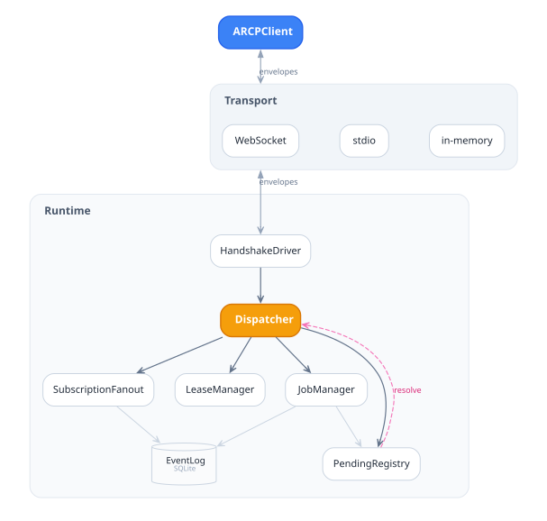
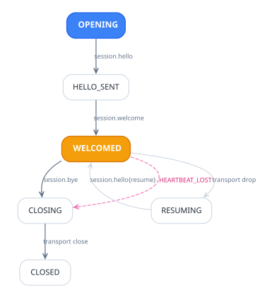

ARCP is a six-piece protocol: envelopes, transports, sessions, jobs,
events, and leases (with delegation as a recursive case of the latter
five). This page covers the ground vocabulary; per-feature pages under
[`03-features/`](03-features/) cover the v1.1 negotiated additions.

## Architecture

<picture>
  <source media="(prefers-color-scheme: dark)" srcset="diagrams/arch-overview-dark.svg">
  
</picture>

A client owns a `Transport` and an `ARCPClient`; the runtime owns the
agent registry, lease validator, and event log, and accepts one
`Transport` per peer. Transports are interchangeable — `MemoryTransport`
for in-process tests, `WebSocketTransport` for the network case,
`StdioTransport` for child-process subagents (spec §4.2).

## Envelopes

Every message on the wire is an `Envelope` (`arcp.Envelope`,
`arcp/_envelope.py`). The required fields are `arcp` (protocol
version), `id` (ULID), `type` (dotted verb such as `session.hello`,
`job.submit`, `job.event`), and `payload` (verb-specific JSON object).
Optional fields include `session_id`, `job_id`, `trace_id`, and
`event_seq` (monotonic per session, on event-bearing envelopes only).

## Sessions

<picture>
  <source media="(prefers-color-scheme: dark)" srcset="diagrams/session-lifecycle-dark.svg">
  
</picture>

A session is the lifetime of a single transport between one client
and one runtime. The client opens with `session.hello`; the runtime
replies with `session.welcome` (assigning `session_id`, declaring
runtime capabilities, and negotiating the feature intersection per
spec §6.2). Either side ends with `session.bye`; the runtime emits
`session.error` and closes the transport on protocol violations
(spec §12).

Resume (spec §6.3): a client may reattach to a still-live session by
sending `session.hello` with a `resume` field carrying the prior
`session_id` and `last_event_seq`; the runtime replays missed events
in order. After the resume window expires, the runtime answers with
`RESUME_WINDOW_EXPIRED`.

## Jobs

A job is one unit of agent work. The client sends `job.submit`
naming the agent, the input payload, and the requested lease; the
runtime answers with `job.accepted` (assigning `job_id`, echoing the
granted lease) or with `session.error` if submission is rejected
pre-acceptance. Once accepted, the runtime emits a stream of
`job.event` envelopes and exactly one terminal envelope: `job.result`
on success, `job.error` on failure (including cancellation).

Idempotency: the optional `idempotency_key` in `job.submit` is hashed
together with `(principal, agent, input)` per spec §7.4; a duplicate
submit returns the original `job.accepted` instead of allocating a new
job.

## Events

`job.event` envelopes carry a typed `payload.kind` (Python: pydantic
discriminated union on `payload.kind`). Core kinds (spec §8) include
`log`, `thought`, `status`, `metric`, `tool_call`, `tool_result`, plus
the v1.1 additions `progress` (§8.2) and `result_chunk` (§8.4). Each
event carries a per-session `event_seq`; clients negotiating the `ack`
feature (§6.5) periodically `session.ack` the highest sequence
processed, enabling the runtime to apply back-pressure.

## Leases

A lease is a capability bag — `{"net.fetch": ["https://*.example.com/**"], "fs.read": ["/tmp/**"]}`
— that the client requests and the runtime grants in `job.accepted`.
The granted lease must be a non-strict subset of the request (spec
§9.1). Agents call `JobContext.authorize(op, target)` to gate
side effects; the runtime returns `LEASE_SUBSET_VIOLATION` for an
out-of-scope operation. Optional constraints from v1.1 attach
`expires_at` (§9.5) and `cost.budget` (§9.6) to the granted lease;
exhaustion of either yields `LEASE_EXPIRED` or `BUDGET_EXHAUSTED`.

## Delegation

An agent can submit child jobs by holding a `JobContext.delegate(...)`
handle, which opens a nested `ARCPClient` against a peer runtime under
a strict-subset lease of the parent grant (spec §10). The parent's
`job.accepted.parent_job_id` and `trace_id` propagate so the host
trace stays connected end-to-end.

## See also

- Features: [`03-features/`](03-features/).
- Public API per module: [`05-reference/`](05-reference/).
- Spec: [`../../spec/docs/draft-arcp-1.1.md`](../../spec/docs/draft-arcp-1.1.md).
